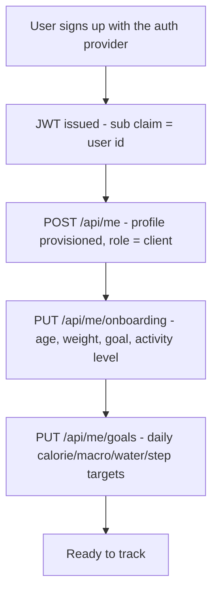
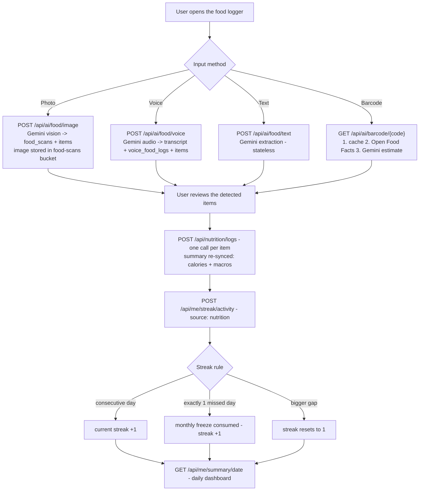
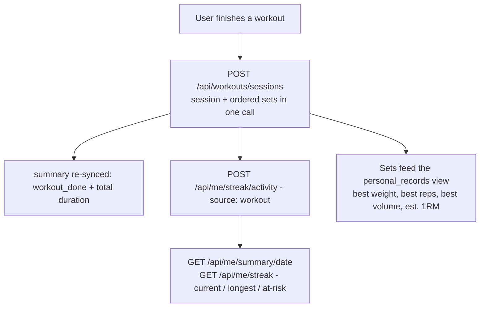
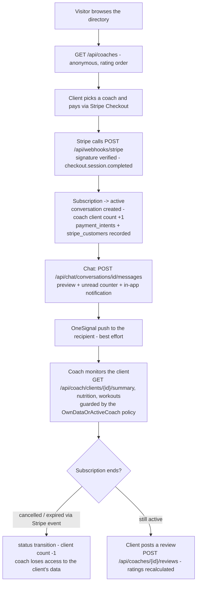
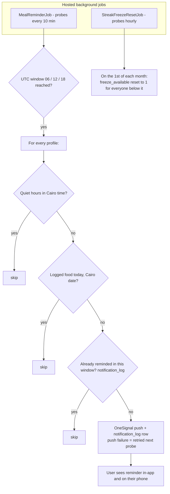
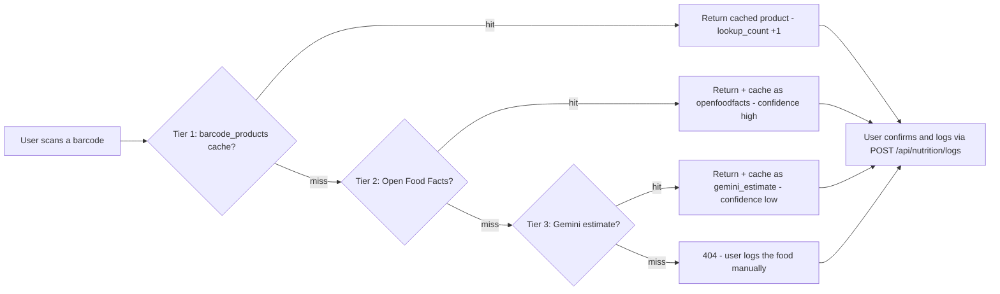

# User flows

How users move through the CoreGym backend. Each step maps to a real endpoint
(see [API.md](API.md)); everything below is enforced by code covered by the
105 integration tests. You can watch these flows execute live by running
`verify.ps1` in the repo root.

> The diagrams are Mermaid — GitHub renders them inline.

## 1. Sign-up & onboarding (new client)

## 2. Daily nutrition logging (4 input paths → one summary)

Every food item lands in `nutrition_logs`; the **daily summary re-syncs
automatically** after each write (the `sync_nutrition_to_summary` replacement),
and the user's streak is fed by the nutrition activity.

## 3. Workout logging

## 4. Coaching: subscribe → chat → monitor → review

## 5. Notifications & reminders (background jobs)

## 6. Barcode scan detail

## What runs where

| Layer | Pieces |
|---|---|
| Client (Flutter) | calls the REST API with a Bearer JWT; owns all confirmations |
| API controllers | thin: resolve the user from the JWT, delegate, map errors to problem details |
| Application services | streaks, summary sync, messaging, notifications, subscription lifecycle, coach ratings, AI, barcode, reminders |
| SQL Server | schema (42 tables), `updated_at` triggers, CHECK constraints, 3 read views |
| External | Gemini, OneSignal, Open Food Facts, Stripe (webhook only) |
